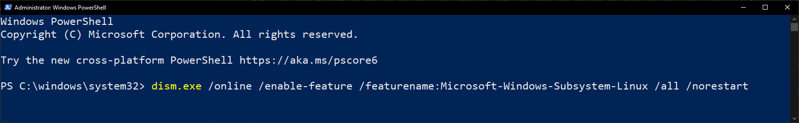

# Installing Ubuntu on Windows

## Introduction

Windows Subsystem for Linux (WSL) is a feature in Windows 10 and 11 that allows you to run native Linux command-line tools directly on Windows. This tutorial will guide you through the installation of Ubuntu (a Linux distribution) on Windows and setting up tools necessary for development.

## Prerequisites

Make sure your Windows is updated to the latest version. You can check for updates by going to `Settings > Update & Security > Windows Update`. You must be running Windows Pro or Enterprise edition to install WSL.

## Installation

### Enable WSL

1. Open PowerShell as an administrator. You can do this by searching for `PowerShell` in the Start menu, right-clicking on it, and selecting `Run as administrator`. You will need to give permission to run it as an administrator.

    

2. Run the following command int the `Powershell` window to enable virtualization, which is needed for WSL. You can copy-paste the command by right-clicking in the `Powershell` window.

    ```bash
    dism.exe /online /enable-feature /featurename:VirtualMachinePlatform /all /norestart
    ```

3. Run the following command in `PowerShell` to enable WSL.

    ```bash
    dism.exe /online /enable-feature /featurename:Microsoft-Windows-Subsystem-Linux /all /norestart
    ```

4. Restart your computer to apply the changes.

### Install Ubuntu

1. Open PowerShell again. This time you can run it normally without administrator privileges.

2. Run the following command in the `Powershell` window to update the WSL system:

    ```bash
    wsl --update
    ```

3. Next, run the following command in the `Powershell` window to set WSL 2 as the default version. This is recommended for better performance.

    ```bash
    wsl --set-default-version 2
    ```

4. Finally, install Ubuntu 22.04 by running the following command in the `Powershell` window:

    ```bash
    wsl --install -d Ubuntu-22.04
    ```

When Ubuntu is installed, it should run automatically. If not you can run it by searching for `Ubuntu` in the Start menu.

On the first run, you will be prompted to create a username and password. You can choose any username and password you like, but **you will need to remember them for future use**.

When you enter the password, it will not show any characters on the screen. This is normal for security reasons.


### Installing VS Code

1. Install [Visual Studio Code](https://code.visualstudio.com/) on Windows. You can do it by opening the Microsoft Store and searching for `Visual Studio Code`. Click on the `Install` button to install it. [Or just follow this link](https://apps.microsoft.com/detail/xp9khm4bk9fz7q)

    VS Code is needed later when setting up some tools for development.

2. Once installed, open Visual Studio Code and install the following extensions:

    - [Remote - WSL](https://marketplace.visualstudio.com/items?itemName=ms-vscode-remote.remote-wsl)
    - [Python](https://marketplace.visualstudio.com/items?itemName=ms-python.python)
    - [C/C++ extension pack](https://marketplace.visualstudio.com/items?itemName=ms-vscode.cpptools-extension-pack)

    You can install extensions by clicking on the `Extensions` icon on the left sidebar in VS Code and searching for the extension name.

### Updating Ubuntu

If you don't have it open, open the Ubuntu terminal by searching for `Ubuntu` in the Start menu. It only offers command-line interface, so you will have to type all the commands in the Ubuntu window.

1. Run the following command to refresh the available software updates for Ubuntu. You will need to enter the password you created during the installation of Ubuntu:

    ```bash
    sudo apt update
    ```

2. Next, run the following command to upgrade the installed software packages:

    ```bash
    sudo apt upgrade
    ```

### Setting up development tools on Ubuntu

If you don't have it open, open the Ubuntu terminal by searching for `Ubuntu` in the Start menu. It only offers command-line interface, so you will have to type all the commands in the Ubuntu window.


1. Run the following command to download a script that installs development tools on Ubuntu:

    ```bash
    wget -O - https://raw.githubusercontent.com/SaxionACS/public/bash/install_all.sh 
    ```

2. Run the downloaded script by running the following command, passing the `-pico` flag. You will need to enter the password you created during the installation of Ubuntu:

    ```bash
    sudo bash install_all.sh -pico
    ```

    This script will take a while to run, as it installs a lot of tools and libraries necessary for development.

> *Info*: The `install_all.sh` script installs the following tools:
> - `git` - a version control system
> - `gcc` - a C compiler
> - `g++` - a C++ compiler
> - `clang` - a C compiler
> - `clang++` - a C++ compiler
> - `make` - a build automation tool
> - `cmake` - a build system generator
> - `gdb` - a debugger
> - `lldb` - another debugger
> - `valgrind` - a memory debugging tool
> - `python3` - a programming language
> - `python3-pip` - a package installer for Python
> - `gcc-arm-none-eabi` - a cross-compiler for ARM processors
> - `pico sdk` - a software development kit for the RPi Pico microcontroller
> - `pico examples` - examples for the RPi Pico microcontroller
> - `pico tools` - tools for the RPi Pico microcontroller
> - `picoprobe` - a debugger for the RPi Pico microcontroller
> - `picotool` - a tool for the RPi Pico microcontroller
>
> It also installs some extensions for Visual Studio Code and many other tools and libraries.


## Solving problems

The following resources can be used to troubleshoot common WLS installation problems:

- [WSL troubleshooting guide](https://docs.microsoft.com/en-us/windows/wsl/troubleshooting)
